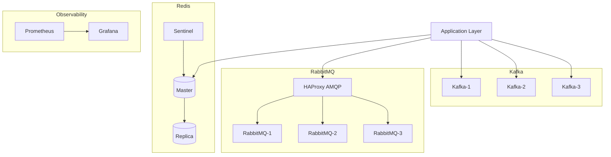
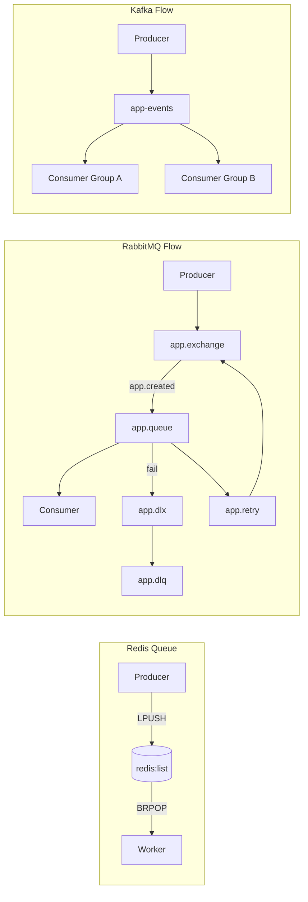

# docker-message-broker-stack

Template infrastruktur **production-ready** berbasis Docker Compose untuk tiga broker utama:

- **Redis** → cache, simple queue, background jobs
- **RabbitMQ** → task queue, routing, retry, dead-letter queue (DLQ)
- **Kafka (KRaft)** → event streaming throughput tinggi

Repository ini disiapkan sebagai baseline DevOps/SRE yang:

- rapi dan modular per komponen,
- aman untuk deployment production,
- praktis untuk local development,
- siap kolaborasi di GitHub (issue/PR template + CI lint compose).

---

## Daftar isi

1. [Overview](#overview)
2. [Kapan pakai Redis, RabbitMQ, Kafka](#kapan-pakai-redis-rabbitmq-kafka)
3. [Arsitektur](#arsitektur)
4. [Diagram Mermaid](#diagram-mermaid)
5. [Struktur repository](#struktur-repository)
6. [Prerequisites](#prerequisites)
7. [Quick start development](#quick-start-development)
8. [Quick start production](#quick-start-production)
9. [Environment variables](#environment-variables)
10. [Port mapping](#port-mapping)
11. [Perintah Makefile](#perintah-makefile)
12. [Contoh penggunaan broker](#contoh-penggunaan-broker)
13. [Monitoring](#monitoring)
14. [Backup & restore](#backup--restore)
15. [Security notes](#security-notes)
16. [Troubleshooting](#troubleshooting)
17. [Production checklist](#production-checklist)
18. [CI/CD GitHub](#cicd-github)
19. [Release notes](#release-notes)
20. [Discussion & support policy](#discussion--support-policy)

---

## Overview

Stack menyediakan dua mode:

### Development

- Redis single node + auth
- RabbitMQ single node + management UI
- Kafka single node KRaft + Kafka UI
- Port terbuka untuk debugging lokal

### Production

- Redis master + replica + sentinel
- RabbitMQ cluster 3 node + HAProxy untuk AMQP
- Kafka KRaft cluster 3 broker/controller
- Prometheus + Grafana + exporters
- Security baseline: non-public broker exposure, no-new-privileges, log rotation

> Tujuan utama: mempercepat bootstrap infrastruktur broker tanpa mengorbankan best practice operasional.

## Kapan pakai Redis, RabbitMQ, Kafka

| Teknologi | Kekuatan Utama | Cocok Untuk | Catatan |
|---|---|---|---|
| Redis | Super cepat, simple, latensi rendah | Cache, queue ringan, background jobs | Tidak ideal untuk event streaming besar jangka panjang |
| RabbitMQ | Routing kuat, ACK/retry/DLQ matang | Task queue, async job, command/event routing | Throughput umumnya di bawah Kafka untuk skala stream besar |
| Kafka | Throughput tinggi, retention, consumer group | Event streaming, data pipeline, audit/event log | Operasional lebih kompleks |

## Arsitektur

- **Compose dev:** `docker-compose.dev.yml`
- **Compose prod:** `docker-compose.prod.yml`
- **Compose monitoring:** `docker-compose.monitoring.yml`

Dokumen detail:

- `docs/architecture.md`
- `docs/redis.md`
- `docs/rabbitmq.md`
- `docs/kafka.md`
- `docs/production-hardening.md`
- `docs/troubleshooting.md`

---

## Diagram Mermaid

Diagram berikut adalah versi inline yang sudah siap render di GitHub.

### 1) Full topology



### 2) Message flow (Redis, RabbitMQ, Kafka)



> Catatan Kafka penting: jangan memperlakukan Kafka seperti endpoint HTTP tunggal di belakang load balancer. Client harus memakai **multi-bootstrap servers** dan `advertised.listeners` yang benar agar broker discovery berjalan normal.

---

## Struktur repository

```text
docker-message-broker-stack/
├── docker-compose.dev.yml
├── docker-compose.prod.yml
├── docker-compose.monitoring.yml
├── redis/
├── rabbitmq/
├── kafka/
├── monitoring/
├── examples/
├── scripts/
└── docs/
```

## Prerequisites

- Docker Engine
- Docker Compose plugin (`docker compose`)
- Linux host direkomendasikan untuk production

Rekomendasi resource:

- Dev: minimal 4 GB RAM
- Prod baseline: minimal 8 GB RAM

## Quick start development

1. Copy env dev:
   - `.env.dev.example` → `.env.dev`
2. Ganti semua secret default
3. Jalankan:
   - `make dev-up`

Perintah umum:

- `make dev-down`
- `make dev-logs`
- `make ps`

## Quick start production

1. Copy env prod:
   - `.env.prod.example` → `.env.prod`
2. Ganti semua secret default (wajib)
3. Validasi environment:
   - `./scripts/validate-env.sh prod`
4. Jalankan:
   - `make prod-up`

Perintah umum:

- `make prod-down`
- `make prod-logs`
- `make rabbitmq-status`
- `make kafka-topics`

## Environment variables

Template tersedia di:

- `.env.example`
- `.env.dev.example`
- `.env.prod.example`

Prinsip:

- Jangan commit `.env`, `.env.dev`, `.env.prod`
- Semua password/credential diambil dari env
- Gunakan secret kuat untuk production

## Port mapping

### Development

| Service | Port |
|---|---:|
| Redis | 6379 |
| RedisInsight (opsional) | 5540 |
| RabbitMQ AMQP | 5672 |
| RabbitMQ Management | 15672 |
| Kafka | 9092 |
| Kafka UI | 8080 |

### Production

| Service | Port | Akses |
|---|---:|---|
| RabbitMQ AMQP via HAProxy | 5672 | App servers (allow-list) |
| Prometheus | 9090 | Network ops/monitoring |
| Grafana | 3000 | Network ops/monitoring |

`Redis` dan `Kafka` tidak diekspos public secara default.

## Perintah Makefile

| Command | Kegunaan |
|---|---|
| `make dev-up` | Start stack development |
| `make dev-down` | Stop stack development |
| `make dev-logs` | Log stack development |
| `make prod-up` | Start stack production + monitoring |
| `make prod-down` | Stop stack production + monitoring |
| `make prod-logs` | Log stack production |
| `make ps` | Cek status container |
| `make redis-cli` | Masuk redis-cli dengan auth |
| `make rabbitmq-status` | Cek status cluster RabbitMQ |
| `make kafka-topics` | List Kafka topics |
| `make test-redis` | Uji SET/GET, queue, stream Redis |
| `make test-rabbitmq` | Uji publish/consume RabbitMQ |
| `make test-kafka` | Uji topics + producer/consumer Kafka |
| `make backup` | Backup named volume |
| `make restore` | Restore named volume |
| `make clean` | Bersihkan stack + volume compose |

## Contoh penggunaan broker

### Redis

- `make test-redis`
- Sample app:
  - `examples/nodejs/redis-queue/`
  - `examples/python/redis-queue/`
  - `examples/laravel/redis-queue-env.example`

### RabbitMQ

- `make test-rabbitmq`
- Sample app:
  - `examples/nodejs/rabbitmq-producer-consumer/`
  - `examples/python/rabbitmq-producer-consumer/`
  - `examples/laravel/rabbitmq-env.example`

### Kafka

- `make test-kafka`
- Default topic prod:
  - `app-events`
  - `order-events`
  - `notification-events`
  - `audit-logs`
- Sample app:
  - `examples/nodejs/kafka-producer-consumer/`
  - `examples/python/kafka-producer-consumer/`

## Monitoring

`docker-compose.monitoring.yml` mencakup:

- Prometheus
- Grafana
- Redis exporter
- RabbitMQ metrics (prometheus plugin)
- Kafka exporter

Grafana provisioning otomatis:

- datasource: `monitoring/grafana/provisioning/datasources/`
- dashboard provider: `monitoring/grafana/provisioning/dashboards/`
- dashboard file: `monitoring/grafana/dashboards/`

## Backup & restore

- `make backup`
- `make restore`

Script:

- `scripts/backup.sh`
- `scripts/restore.sh`

Best practice:

- backup terjadwal,
- restore drill berkala,
- penyimpanan backup terenkripsi.

## Security notes

- Redis/Kafka non-public exposure
- RabbitMQ management disarankan internal/reverse proxy
- Terapkan firewall allow-list
- Gunakan secret kuat dari env
- Hardening container (`no-new-privileges`, `read_only`, `tmpfs`)
- Rotasi log Docker (`json-file`, `max-size`, `max-file`)

Hardening lanjutan:

- TLS untuk Redis/RabbitMQ/Kafka
- Kafka SASL/TLS untuk deployment multi-host
- Docker secrets atau external secret manager

## Troubleshooting

Lihat `docs/troubleshooting.md` untuk kasus:

- Redis NOAUTH
- Redis replica tidak sync
- RabbitMQ node gagal join cluster
- RabbitMQ queue stuck
- Kafka `advertised.listeners` tidak sesuai
- Kafka broker gagal join quorum
- Kafka consumer tidak menerima message
- Port conflict / already allocated
- Permission denied pada volume

## Production checklist

- [ ] Semua secret default sudah diganti
- [ ] Broker private port tidak terbuka public
- [ ] Firewall/UFW allow-list aktif
- [ ] Monitoring dan dashboard tervalidasi
- [ ] Backup + restore test tervalidasi
- [ ] Docker log rotation aktif
- [ ] Failover Redis Sentinel tervalidasi
- [ ] RabbitMQ cluster status sehat
- [ ] Kafka quorum + consumer-group test lulus

## CI/CD GitHub

Sudah tersedia:

- Issue templates: `.github/ISSUE_TEMPLATE/`
- PR template: `.github/pull_request_template.md`
- CI lint compose: `.github/workflows/ci-compose-lint.yml`

CI memvalidasi konfigurasi:

- `docker-compose.dev.yml`
- `docker-compose.prod.yml`
- `docker-compose.prod.yml + docker-compose.monitoring.yml`

## Release notes

- Changelog utama: `CHANGELOG.md`
- Detail rilis awal: `docs/releases/v1.0.0.md`

Rekomendasi untuk maintainers:

- gunakan `CHANGELOG.md` sebagai sumber resmi perubahan,
- salin ringkasan dari `docs/releases/<version>.md` saat membuat GitHub Release.

## Discussion & support policy

- Support policy: `SUPPORT.md`
- GitHub Discussions: https://github.com/BataraKresn/docker-message-broker-stack/discussions

Alur yang direkomendasikan:

1. Pertanyaan umum / best practice → **Discussions**
2. Bug terverifikasi / feature request → **Issues**
3. Vulnerability security → jalur privat (bukan issue publik)

---

## Dokumen pendukung

- `docs/architecture.md`
- `docs/redis.md`
- `docs/rabbitmq.md`
- `docs/kafka.md`
- `docs/production-hardening.md`
- `docs/troubleshooting.md`
