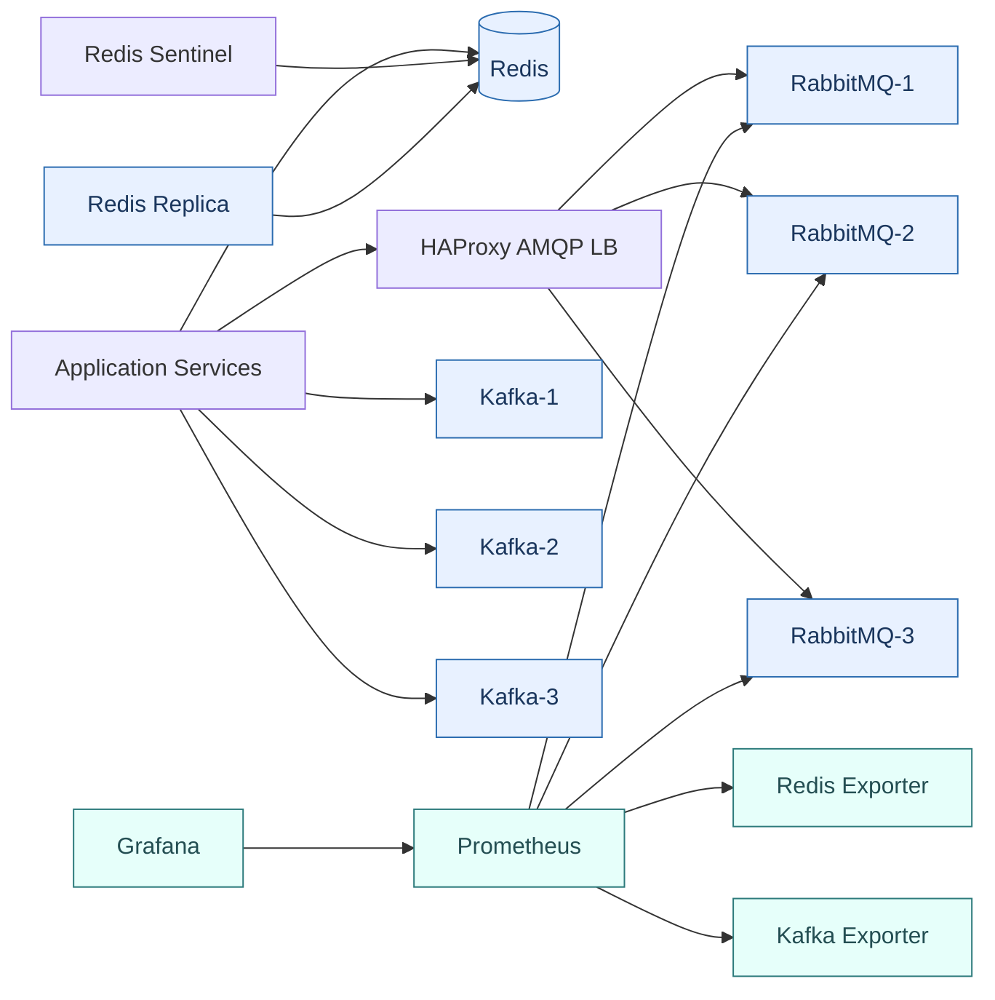
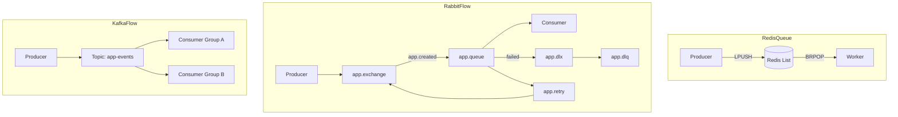

# Arsitektur Stack Message Broker

Dokumen ini menjelaskan topologi development dan production.

## Topologi Full Stack

## Message Flow

## Catatan Kafka dan Load Balancer

Kafka **bukan** HTTP service biasa. Load balancer (jika ada) hanya untuk kebutuhan bootstrap/internal terbatas. Konfigurasi utama tetap:

- `bootstrap.servers` berisi beberapa broker
- `advertised.listeners` benar dan bisa di-resolve oleh client
